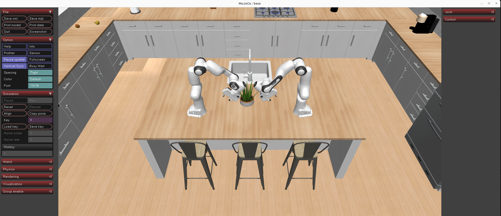

Bimanual Panda Robot Simulation in Mujoco
===

Two Panda arms in Mujoco.

## How to Use
1. Run `robocasa_gen.py` to generate your desired kitchen scene with bimanual panda arms.
2. Use `kitchen_simulation.ipynb` to visualize and control mujoco simulation

## Demo

1. Mujoco Viewer

2. Scene Anime

